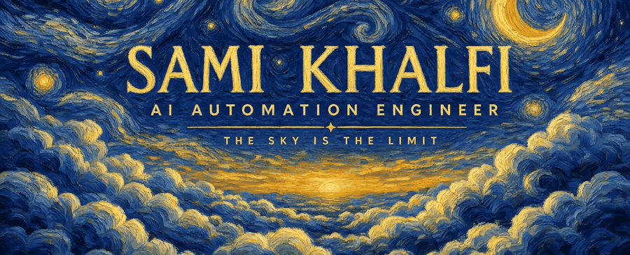

<!-- ═══════════════════════════ HERO — living Van Gogh painting ═══════════════════════════ -->
<p align="center">
  
</p>

<p align="center">
  <a href="https://samikhalfi.xyz">
    
  </a>
</p>

<p align="center">
  <a href="https://samikhalfi.xyz"></a>
  <a href="https://www.linkedin.com/in/sami-khalfi-355098290/"></a>
  <a href="mailto:samikhalfi2003@gmail.com"></a>
  
</p>

<!-- ═══════════════════════════ WHOAMI ═══════════════════════════ -->
<p align="center"></p>

```bash
sami@sky:~$ whoami
AI Automation Engineer · Data Scientist · ML/DL Engineer

sami@sky:~$ cat mission.txt
Building the next AI empire, one automation at a time.
I design multi-agent systems, machine & deep learning models,
and end-to-end automation pipelines that run businesses
while their founders sleep.

sami@sky:~$ ls ~/current/
├── saas/                 # my own SaaS — in active development
├── agents-and-skills/    # custom AI agents & reusable skills
├── mcp-servers/          # plugging AI into everything
├── ml-lab/               # models — training, tuning, shipping
└── client-automations/   # full-stack business automation
```

<!-- ═══════════════════════════ WHAT I DO ═══════════════════════════ -->
<p align="center"></p>

<table width="100%">
<tr>
<td width="25%" align="center">
  
  <h3>Agentic AI</h3>
  Multi-agent systems, custom skills, MCP servers, RAG architectures, LLM orchestration — AI that <i>does</i>, not just talks.
</td>
<td width="25%" align="center">
  
  <h3>Automation</h3>
  End-to-end business automation with n8n, Python &amp; Docker. From lead intake to invoicing — if it's repetitive, I make it disappear.
</td>
<td width="25%" align="center">
  
  <h3>Data Science &amp; ML/DL</h3>
  From raw data to deployed models — deep learning, computer vision, NLP and real-time data pipelines.
</td>
<td width="25%" align="center">
  
  <h3>SaaS</h3>
  Shipping my own AI-powered products. Founder mode: design, build, deploy, iterate. The sky is the limit.
</td>
</tr>
</table>

<!-- ═══════════════════════════ CLIENTS ═══════════════════════════ -->
<p align="center"></p>

<p align="center">Freelance AI automation work, embedded like a team member:</p>

<p align="center">
  
  
  
  
  
  
  
</p>

<!-- ═══════════════════════════ ARSENAL ═══════════════════════════ -->
<p align="center"></p>

<h4 align="center">Languages</h4>
<p align="center">
  
  
  
  
  
  
  
</p>

<h4 align="center">AI · Agents · LLMs</h4>
<p align="center">
  
  
  
  
  
  
  
  
  
</p>

<h4 align="center">Machine Learning · Deep Learning · Data Science</h4>
<p align="center">
  
  
  
  
  
  
  
  
  
</p>

<h4 align="center">Automation · Backend</h4>
<p align="center">
  
  
  
  
  
  
</p>

<h4 align="center">Data · Streaming · Pipelines</h4>
<p align="center">
  
  
  
  
  
  
  
</p>

<h4 align="center">Cloud · DevOps</h4>
<p align="center">
  
  
  
  
  
  
  
</p>

<!-- ═══════════════════════════ MISSION ═══════════════════════════ -->
<p align="center"></p>

<table width="100%">
<tr>
<td align="center">

**Found the empire** — ship my own AI SaaS and scale it to the world

**Automate entire industries** — not tasks. Whole businesses, end-to-end

**Master the frontier** — agents, ML/DL, and whatever comes next

**Keep ascending** — the sky was never the limit. It was the starting line

</td>
</tr>
</table>

<!-- ═══════════════════════════ STATS ═══════════════════════════ -->
<p align="center"></p>

<table width="100%">
<tr>
<td width="50%">

</td>
<td width="50%">

</td>
</tr>
</table>

<div align="center">

</div>

<!-- ═══════════════════════════ SNAKE ═══════════════════════════ -->
<p align="center">
  
</p>

<!-- ═══════════════════════════ FOOTER ═══════════════════════════ -->
<p align="center">
  
</p>

<p align="center">
  <code>while alive: automate(); ascend()</code>
</p>
