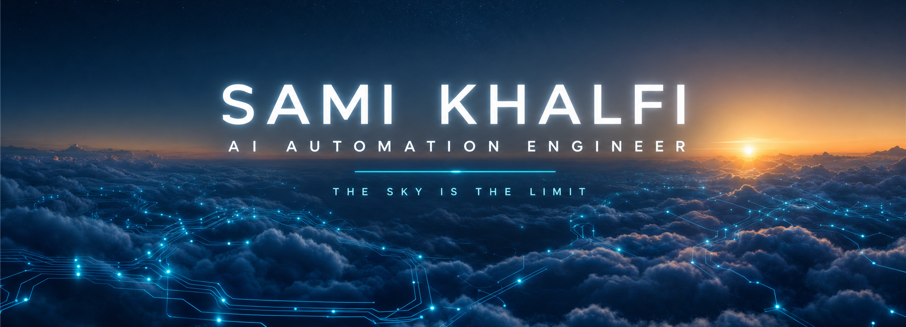
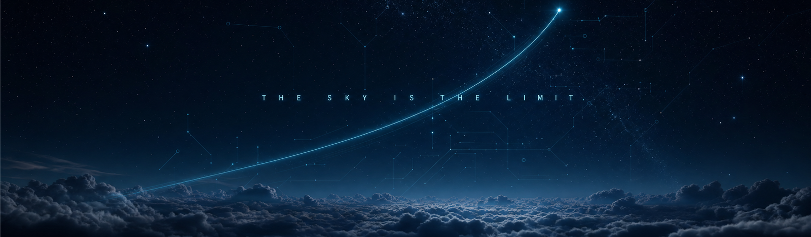

<!-- ═══════════════════════════ HERO ═══════════════════════════ -->
<p align="center">
  
</p>

<p align="center">
  <a href="https://samikhalfi.xyz">
    
  </a>
</p>

<p align="center">
  <a href="https://samikhalfi.xyz"></a>
  <a href="https://www.linkedin.com/in/sami-khalfi-355098290/"></a>
  <a href="mailto:samikhalfi@esi.ac.ma"></a>
  
</p>

<br/>

<!-- ═══════════════════════════ WHOAMI ═══════════════════════════ -->
## ⚡ `$ whoami`

```bash
sami@sky:~$ whoami
AI Automation Engineer 🇲🇦 — agents, MCP servers & automation pipelines

sami@sky:~$ cat mission.txt
Building the next AI empire, one automation at a time.
I design multi-agent systems and end-to-end automation pipelines
that run businesses while their founders sleep.

sami@sky:~$ ls ~/current/
├── 🚀 saas/                # building my own SaaS — in active development
├── 🤖 agents-and-skills/   # custom Claude Code agents & skills
├── 🔌 mcp-servers/         # plugging AI into everything
└── ⚙️ client-automations/  # full-stack business automation
```

<br/>

<!-- ═══════════════════════════ WHAT I DO ═══════════════════════════ -->
## 🛠️ What I Do

<table width="100%">
<tr>
<td width="33%" align="center">
  <h3>🤖 Agentic AI</h3>
  Multi-agent systems, custom skills & MCP servers, RAG architectures, LLM orchestration — AI that <i>does</i>, not just talks.
</td>
<td width="33%" align="center">
  <h3>⚙️ Automation</h3>
  End-to-end business automation with n8n, Python & Docker. From lead intake to invoicing — if it's repetitive, I make it disappear.
</td>
<td width="33%" align="center">
  <h3>🚀 SaaS</h3>
  Shipping my own AI-powered software as a service. Founder mode: design, build, deploy, iterate. The sky is the limit.
</td>
</tr>
</table>

<br/>

<!-- ═══════════════════════════ CLIENTS ═══════════════════════════ -->
## 🤝 Companies I've Automated

Freelance AI automation work, embedded like a team member:

<p align="center">
  
  
  
  
  
  
  
</p>

<br/>

<!-- ═══════════════════════════ ARSENAL ═══════════════════════════ -->
## 🧰 The Arsenal

**🧠 AI & Agents**

<p>
  
  
  
  
  
  
  
  
  
</p>

**⚙️ Automation & Backend**

<p>
  
  
  
  
  
  
  
</p>

**📊 Data & Cloud**

<p>
  
  
  
  
  
  
  
  
</p>

<br/>

<!-- ═══════════════════════════ MISSION ═══════════════════════════ -->
## 🎯 2026 Mission

- 🚀 **Ship my own SaaS** — from automation engineer to AI founder
- 🤖 **Grow the arsenal** — custom agents, skills & MCP servers for every workflow
- 🌍 **Automate businesses end-to-end** — embedded AI engineering for ambitious teams
- ☁️ **Reach the sky** — because that's the only limit

<br/>

<!-- ═══════════════════════════ STATS ═══════════════════════════ -->
## 📊 GitHub Stats

<table width="100%">
<tr>
<td width="50%">

</td>
<td width="50%">

</td>
</tr>
</table>

<div align="center">

</div>

<br/>

<!-- ═══════════════════════════ FOOTER ═══════════════════════════ -->
<p align="center">
  
</p>

<p align="center">
  <code>while alive: automate(); ascend()</code>
</p>
